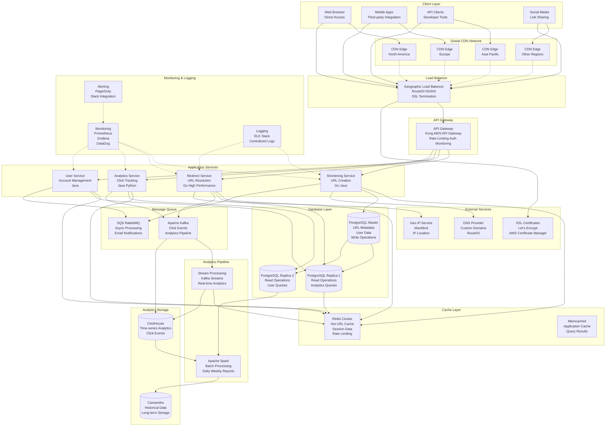

# URL Shortener Architecture Diagram

## How to View This Diagram

1. **GitHub/GitLab**: This Mermaid diagram will render automatically when viewing the file
2. **VS Code**: Install the "Mermaid Preview" extension
3. **Online**: Copy the diagram code to [mermaid.live](https://mermaid.live)
4. **Documentation sites**: Works with GitBook, Notion, etc. 